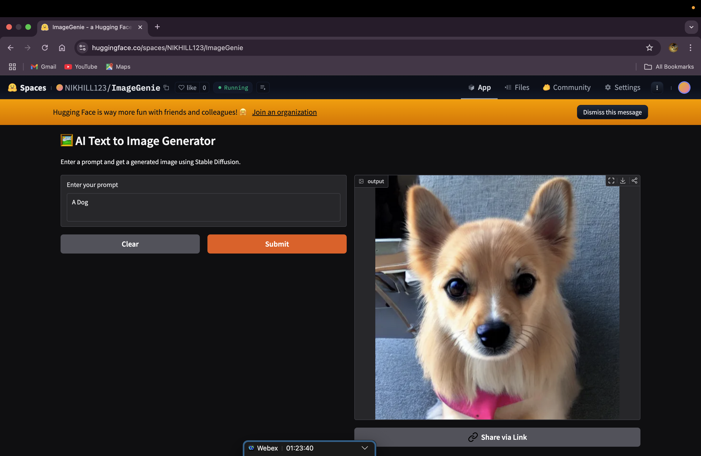
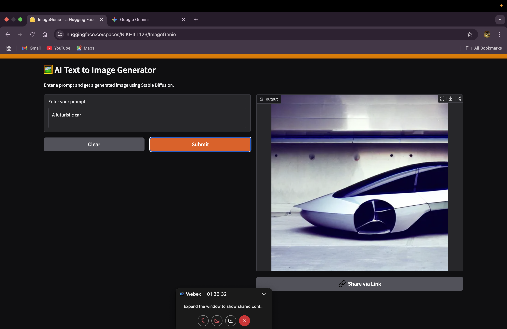

# AI Text-to-Image Generator

This app converts natural language prompts into images using Stable Diffusion and Gradio.
# My Project

This is a brief description of my project.

## Project Output Screenshots

### Screenshot 1: User Interface

This screenshot shows the main user interface of the application.

### Screenshot 2: Data Visualization

This screenshot illustrates the data visualization component of the project.

